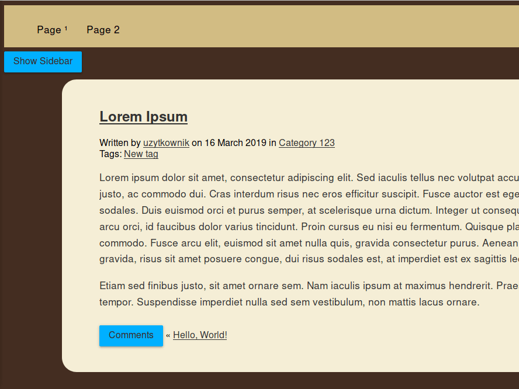

# Ocean Cream

Quick overwiew:

- Only 2 php files → author.php and index.php
- Lightweight WordPress blog theme
  - Main index.php 
  - Critical.min.css (load in header) 
  - Style.css (load in footer) 
  - Buttons.min.js 
- Non-white and minimalistic
- Responsive web design
- Faster website (compared to Twenty Nineteen)
- jQuery only on demand
- Hidden sidebar and comments
- My goal is for the theme to be at least 90% compatible with Google PageSpeed Insight after adding the cache (Expire Headers and Gzip) in htaccess.

## Install

Generally, you should use WordPress repo, but at this moment I wait for approval. https://themes.trac.wordpress.org/ticket/63048

1. Download and install [github-updater](https://github.com/afragen/github-updater/archive/develop.zip)

2. Select correct theme and branch.

2. Wait few seconds.

3. Active
4. [Optional] Test. Edit style.css from 0.93 to 0.90. save. Check new updates. It should be show new Ocean Cream version to update.

### Zdjęcia, zdjęciami ale jak wygląda motyw "na żywo" ? | I would like to see a live version

Of course, look at https://skri.ga/nieoznaczony/ (news/status)
or https://skri.ga/eastern/ (post)

## Child themes:
+ Add your child theme (full or little changes).
